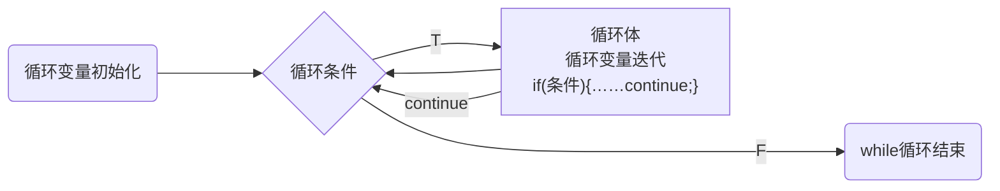

[[控制结构|返回]]
- continue基本介绍：
	- 1、`continue`语句用于**结束本次**循环，继续执行下一次循环。
	- 2、`continue`出现在多层嵌套的循环语句体中，可以通过标签指明要跳过的是哪一层循环——同前面的标签使用规则一致
---
#### 基本语法
```java
……
continue;
……
```

---
#### 案例
```java
int i = 1;
while (i <= 4){
	i++;
	if(i == 2){
		continue;
	} // 跳过i==2的情况
	system.out.println("i=" + i);
}
```
---
#### 细节案例分析
```java
label1:
for(int j = 0; j < 4; j++){
	label2:
	for(int i = 0; i < 10; i++){
		if(i == 2){
			// 分析continue
			continue; //等价于label2
			continue label2;
			continue label1;
		}
		System.out.println("i=" + i);
	}
}
```

---