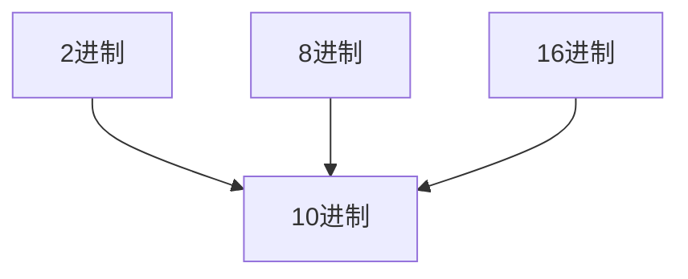

- [[运算符|返回]]  
- [[二进制]]
- [[其他进制-->10进制]] 
- [[10进制-->其他进制]]  
- [[2进制-->其他进制]] 
- [[8进制16进制-->转2进制]] 
---

- ---
#### 2进制转10进制
- 从最低位开始，$每个位的数\times2^{位数-1}$ ，再求和
$$\sum每个位的数(从右开始)\times2^{位数-1}$$
$$0b1011~=~1\times1^{0}+1\times2^{1}+0\times2^{2}+1\times2^{3}$$
---
#### 8进制转10进制
- 从最低位开始，$每个位的数\times8^{位数-1}$ ，再求和
$$\sum每个位的数(从右开始)\times8^{位数-1}$$
---
#### 16进制转10进制
- 从最低位开始，$每个位的数\times16^{位数-1}$ ，再求和
$$\sum每个位的数(从右开始)\times16^{位数-1}$$