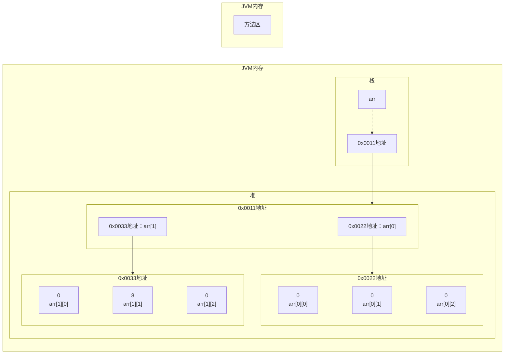

[返回](数组、排序和查找.md)

## 二维数组

- 应用场景：五子棋游戏，棋盘需要二维数组来表示

## 案例入门

- `TwoDimensionalArray01.java`  
- 请用二维数组输出如下图形：
$$0~0~0~0~0~0\newline0~0~1~0~0~0\newline0~2~0~3~0~0\newline0~0~0~0~0~0$$
```java
public class TwoDimensionalArray01{
    public static void main(String[] args){
        //定义二维数组
        int[][] arr = {{0,0,0,0,0,0},
        {0,0,1,0,0,0},{0,2,0,3,0,0},
        {0,0,0,0,0,0}};
        //输出二维数组图形
        //遍历二维数组的每个数组元素
        for(int i = 0; i < arr.lengh; i++){
            //遍历二维数组的每个元素
            //arr[i] 表示二维数组的第i+1个元素
            //arr[i].length 得到对应的每个一维数组的长度
            for(int j = 0; j < arr[i].lengh; j++){
                System.out.println(arr[i][j] + " ");
            }
            System.out.println();//换行
        }
    }
}
```
- 什么是二维数组：
  - 1、形式：`int[][]`
  - 2、原来一维数组的每个元素是一维数组
- 关键概念：
  - 1、二维数组的元素个数：`arr.length`
  - 2、二维数组的每个元素是一维数组，所有如果需要得到每个一维数组的值，需要再次遍历
  - 3、访问第**i+1**个一维数组的第**j+1**个值：`arr[i][j]`;

## 二维数组的使用
- **使用方式①:动态初始化**
```java
类型[][] 数组名 = new 类型[大小][大小];
//比如：
int a[][] = new int[2][3];
```

```java
public class TwoDimensionalArray02{
    public static void main(String[] args){
        int arr[][] = new int[2][3];
        for(int i = 0; i < arr.lengh; i++){
            for(int j = 0; j < arr[i].lengh; j++){
                System.out.println(arr[i][j] + " ");
            }
            System.out.println();//换行
        }
    }
}
```
```java
int arr[][] = new int[2][3];
arr[1][1] = 8;
```



