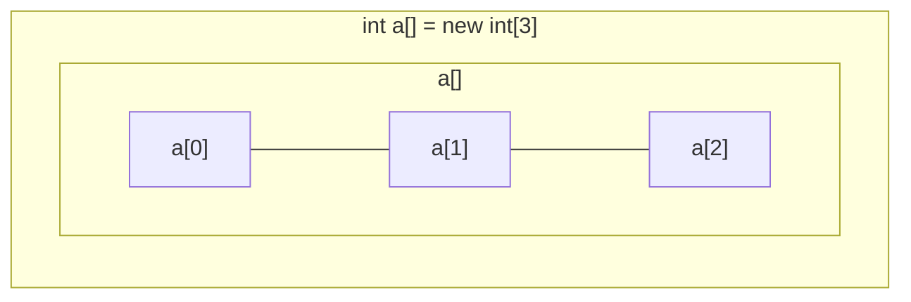

[返回](数组、排序和查找.md)

# 数组
- [数组](#数组)
  - [介绍](#介绍)
  - [案例](#案例)
  - [数组的使用](#数组的使用)
  - [使用细节](#使用细节)
  - [数组赋值机制](#数组赋值机制)
  - [数组拷贝](#数组拷贝)
  - [数组反转](#数组反转)
  - [数组扩容](#数组扩容)
  - [数组缩减](#数组缩减)

## 介绍
- 可以存放**多个**同一类型的数据。数组也是一种数据类型，是引用类型。  
- 数组就是一组数据
——[数据类型](数据类型.md)

## 案例
- [ ] [数组案例](数组案例.md)
- [ ] [练习题-数组应用](练习题-数组应用.md)

## 数组的使用
- **使用方式①：动态初始化**
```java
//声明并创建数组
数据类型 数组名[] = new 数据类型[大小] 或
数据类型[] 数组名 = new 数据类型[大小] 
int a[] = new int[3]
```


- **使用方式②：动态初始化**
```java
//先声明数组
数据类型 数组名[];或 
数据类型[] 数组名;
int a[]; 或
int[] a;
//创建数组
数组名 = new 数据类型[大小]
a = new int[10];
```
- **使用方式③：静态初始化**  
```java
数据类型 数组名[] = {元素值,元素值…};
int a[] = {2, 5, 6, 8, 9};
```

## 使用细节

- 1、数组是多个相同类型数据的组合，实现对这些数据的统一管理  
- 2、数组中的元素可以是任何数据类型，包括**基本类型**和**引用类型**，但不能混用
- 3、数组创建后，如果没有赋值，有默认值
<center>

|int|short|byte|long|float|double|
|:-:|:-:|:-:|:-:|:-:|:-:|
|0|0|0|0|0.0|0.0|

|char|boolean|String|
|:-:|:-:|:-:|
|\u0000|false|null|
</center>

- 4、使用数组的步骤：①声明数组并开辟空间 ②给数组各个元素赋值 ③使用数组
- 5、数组的下标是从0开始的
- 6、数组的下标必须在指定范围内使用，否则报错：下标越界异常，比如`int arr[] = new int[5]`有效下标为**0-4**
```java
int arr[] = new int[5];
//下标最大为 长度-1
System.out.println(arr[4]);
```
- 7、数组属于引用类型，数组型数据是**对象(object)**
## 数组赋值机制
#⭐
<span id= "jump"> </sapn>

- 1、对比：**基本数据类型赋值**，这个值就是具体的数据，互相不影响  
`int n1 = 2; int n2 = n1;`  
- 2、数组在默认下是引用传递，赋的值是地址
- [ ] [数组赋值案例](数组赋值案例.md)

## 数组拷贝
- 编写代码：实现数组拷贝`ArrayCopy.java`
- 将`int[] arr1 = {10,20,30};`拷贝到`arr2`中，要求数据空间是独立的
- [ ] [数组拷贝案例](数组拷贝案例.md)

## 数组反转
- [ ] [数组反转](数组反转.md)

## 数组扩容

- 要求：实现动态的给数组条件元素效果，实现对数组的扩容。`ArrayAdd.java`
  - 1、原始的数组使用静态分配 `int[]arr = {1,2,3};`
  - 2、增加的元素，直接放在数组的最后 `arr = {1,2,3,4}`
  - 3、用户可以通过如下方法来决定是否继续添加,添加成功，是否继续 `y/n`
- [ ] [数组扩容](数组扩容)

## 数组缩减
- [ ] [数组缩减](数组缩减)