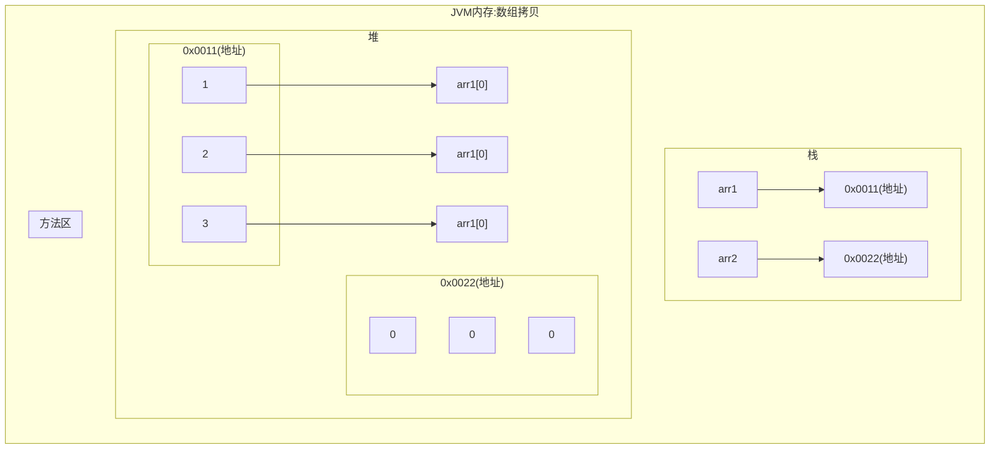

[返回](数组.md#数组拷贝)

- 编写代码：实现数组拷贝`ArrayCopy.java`
- 将`int[] arr1 = {10,20,30};`拷贝到`arr2`中，要求数据空间是独立的

```java
public class Arraycopy {
    public static void main(String[] args){
        int[] arr1 = {10,20,30};
        // 创建一个新的数组，开辟新的数据空间
        // 大小与arr1.length
        int[] arr2 = new int[arr1.length];
        //遍例arr1，把每个元素拷贝到对应的位置
        for(int i = 0; i < arr1.length; i++){
            arr2[i] = arr1[i];
        }
    }
}
```

