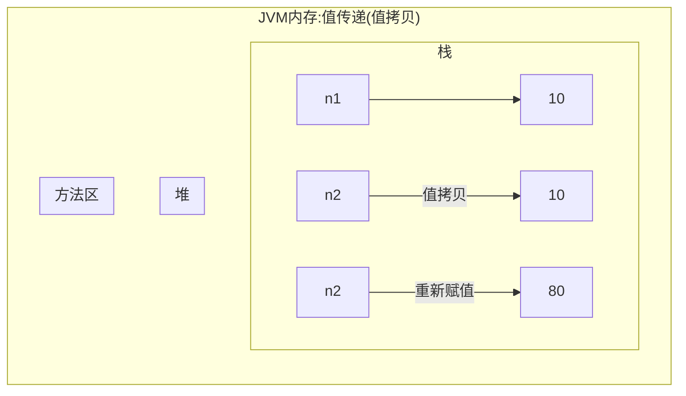
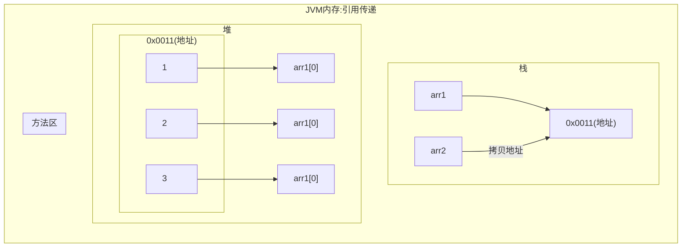

[返回](./数组.md#数组赋值机制)

- 1、对比：基本数据类型赋值，这个值就是具体的数据，互相不影响  
`int n1 = 2; int n2 = n1;`
- 2、数组在默认下是引用传递，赋的值是地址

```java
public class ArrayAssign {
    public static void main(String[] args){
        //基本数据类型赋值，为值拷贝
        int n1 = 10;
        int n2 = n1;
        n2 = 80; //n1不受n2的影响
        System.out.println("n1=" + n1);
        System.out.println("n2=" + n2);
        //数组赋值，为引用赋值，arr2的变化会影响arr1
        int[] arr1 ={1,2,3};
        int[] arr2 =arr1; 把arr1赋给arr2
        arr2[0] = 10;
        System.out.println("====arr1的元素如下====")
        for(int i = 0; i <arr1.length; i++){
            System.out.println(arr1[i]);
        }
    }
}
```
 - 值传递和引用传递的区别





