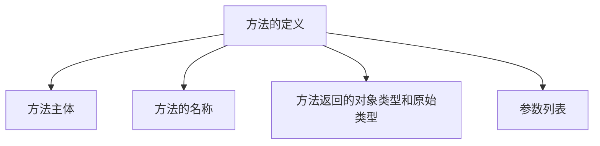

---
aliases:
  - 行为
  - 抽象方法
  - 具体方法
  - 成员方法
---
构造方法=构造器

- 抽象方法：使用[[abstract]]修饰的方法
- 具体方法：没有使用[[abstract]]修饰的方法

![[方法示例.png]]
#### 方法的组成元素

---
#### 声明成员方法的语法
#📉代码 
```java
public class Test{
	[public|private|protected][static]<void|return_type><method_name>([paramList]) {
	//方法体
	  }
}
```
- [[public]]——[[static]]——[[final]]——[[abstract]] 
---
#### 构造方法
* 每个类都有构造方法。如果没有显式地为类定义构造方法，Java 编译器将会为该类提供一个默认构造方法。在创建一个对象的时候，至少要调用一个构造方法。构造方法的名称必须与类同名，一个类可以有多个构造方法。
* 在Java中，构造函数（Constructor）是一种特殊的方法，用来在创建对象时初始化对象的状态。构造函数与类同名，并且在创建类的新对象时自动调用。
* 构造函数的定义包括构造函数名称（与类名相同）以及在其后面的圆括号中的参数列表。在这个参数列表中，可以定义任意数量的参数，每个参数都有自己的类型。

* 下面是一个构造方法示例：

#📉代码 创建构造方法
```java
public class Puppy{
    public Puppy(){
    }
	 
    public Puppy(String name){
        // 这个构造器仅有一个参数：name
    }
}
```
---
